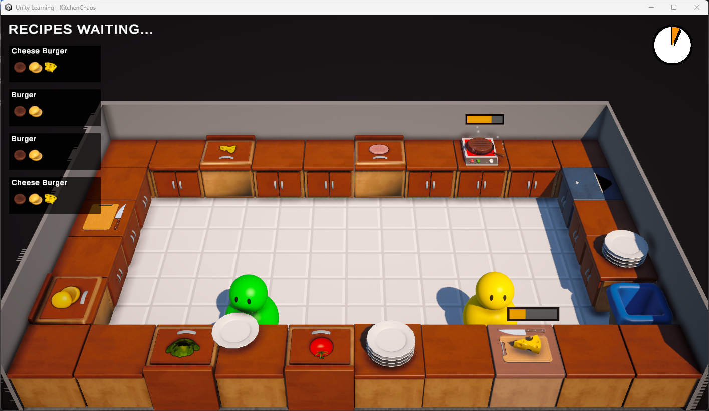

# unity-learning_KitchenChaos_Multiplayer
For learning unity multiplayer

---

I follow the [Code Monkey](https://www.youtube.com/@CodeMonkeyUnity) - [Learn Unity Multiplayer (FREE Complete Course, Netcode for Game Objects Unity Tutorial 2023)](https://www.youtube.com/watch?v=7glCsF9fv3s) tutorial.

---

### Images

   
   

